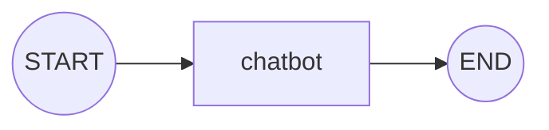

# İlk Grafını Kur — Basit Bir Chatbot

<span class="badge badge-baslangic">🟢 BAŞLANGIÇ</span>

Bu sayfada, mesaj geçmişini hatırlayan basit bir chatbot grafı kuracağız.

## 1. State tanımı

```python
from typing import TypedDict, Annotated
from langgraph.graph.message import add_messages

class State(TypedDict):
    messages: Annotated[list, add_messages]
```

## 2. Node fonksiyonu

```python
from langchain_openai import ChatOpenAI

llm = ChatOpenAI(model="gpt-4o-mini")

def chatbot(state: State):
    return {"messages": [llm.invoke(state["messages"])]}
```

## 3. Grafı kur ve derle

```python
from langgraph.graph import StateGraph, START, END

builder = StateGraph(State)
builder.add_node("chatbot", chatbot)
builder.add_edge(START, "chatbot")
builder.add_edge("chatbot", END)

app = builder.compile()
```

## 4. Çalıştır

```python
sonuc = app.invoke({"messages": [("user", "Türkiye'nin başkenti neresi?")]})
print(sonuc["messages"][-1].content)
```

## Grafı görselleştirme

Geliştirme sırasında grafın yapısını görmek faydalıdır:

```python
from IPython.display import Image
Image(app.get_graph().draw_mermaid_png())
```

Jupyter dışında çalışıyorsanız, `app.get_graph().draw_mermaid()` ile Mermaid metnini alıp [mermaid.live](https://mermaid.live) üzerinde görebilirsiniz. `draw_mermaid()` çıktısı, bu sitede gördüğünüz diyagramlarla aynı formattadır, örneğin bu grafın çıktısı şuna benzer:



!!! tip "LangGraph Studio ile canlı görselleştirme"
    `langgraph dev` komutuyla çalıştırdığınızda statik bir görselden çok daha fazlasını elde edersiniz — grafı tıklayarak adım adım çalıştırabileceğiniz görsel bir hata ayıklama arayüzü. Detaylar: [langgraph.json & CLI](../ileri-seviye/deployment-cli.md).

---

Sıradaki adım: [Workflows vs Agents](workflows-vs-agents.md) — grafını kurmadan önce hangi tür sistem inşa ettiğini netleştir.
