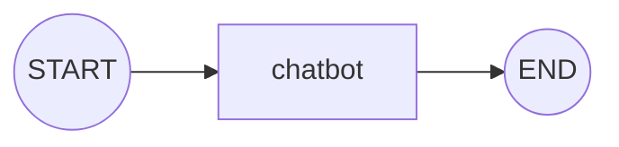

# Temel Kavramlar — State, Node, Edge

<span class="badge badge-baslangic">🟢 BAŞLANGIÇ</span>

!!! abstract "Terimler hakkında"
    Bu sayfadaki terimler ilk geçtikleri yerde kısaca açıklanıyor. Hepsinin toplu listesi için: [Sözlük](../sozluk.md).

## Neden LangGraph?

LangChain'deki LCEL zincirleri (`prompt | llm | parser`) **doğrusaldır**: A adımından B'ye, B'den C'ye gider. Ama gerçek ajan sistemlerinde ihtiyacınız olan şey genellikle şudur:

- Bir aracı çağır → sonucu değerlendir → **gerekirse tekrar çağır** (döngü — *loop*)
- Duruma göre **farklı bir yola** sap (dallanma — *branching*)
- Uzun süren bir işlemi **yarıda kesip devam ettirebilmek** (kalıcılık — *persistence*)

LangGraph bu üç ihtiyacı karşılamak için tasarlanmış, graf tabanlı bir orkestrasyon kütüphanesidir.

## State (Durum)

**State**, grafın tüm node'ları (düğüm) arasında akan, paylaşılan veri yapısıdır. Genellikle bir `TypedDict` olarak tanımlanır:

```python
from typing import TypedDict, Annotated
from langgraph.graph.message import add_messages

class State(TypedDict):
    messages: Annotated[list, add_messages]
    kullanici_id: str
```

!!! warning "Reducer (indirgeyici) nedir, neden önemli?"
    **Reducer**, bir state alanına yeni bir değer geldiğinde bu değerin öncekiyle **nasıl birleştirileceğini** belirleyen fonksiyondur. Varsayılan olarak (reducer tanımlanmazsa) bir node, state alanını **üzerine yazar**. `Annotated[list, add_messages]` gibi bir reducer tanımlarsanız, yeni değer eskisinin üzerine yazılmaz, **ona eklenir**. Mesaj geçmişi gibi büyüyen veriler için reducer kullanmazsanız her node'da geçmişi kaybedersiniz.

### Hazır şablon: MessagesState

Sadece mesaj geçmişi tutan bir state için her seferinde `TypedDict` yazmaya gerek yok — LangGraph hazır bir şablon sunar:

```python
from langgraph.graph import MessagesState

class State(MessagesState):
    kullanici_id: str  # kendi ek alanlarını miras alarak genişletebilirsin
```

`MessagesState`, `messages: Annotated[list, add_messages]` alanını senin için tanımlar. Ek alana ihtiyacın yoksa doğrudan `MessagesState`'i kullanabilirsin.

## Node (Düğüm)

Her **node** (düğüm), state'i parametre olarak alan ve state'e eklenecek **kısmi güncellemeyi** döndüren bir Python fonksiyonudur:

```python
def chatbot(state: State):
    yanit = llm.invoke(state["messages"])
    return {"messages": [yanit]}  # tüm state değil, sadece güncellenen kısım
```

## Edge (Kenar)

**Edge**'ler (kenar), node'lar arasındaki akışı tanımlar — hangi node'dan sonra hangisine geçileceğini belirler.

- **Sabit kenar** (*fixed edge*): her zaman aynı sıradaki node'a gider — `graph.add_edge("a", "b")`
- **Koşullu kenar** (*conditional edge*, "dallanma" da denir): state'e bakarak hangi node'a gidileceğine çalışma zamanında karar verir — `graph.add_conditional_edges(...)`

`START` ve `END`, grafın giriş ve çıkış noktalarını belirten özel düğümlerdir.

## Grafı derleme (compile)

`compile()`, tanımladığınız node/edge yapısını **çalıştırılabilir bir uygulamaya** dönüştüren adımdır; bu adımdan önce graf sadece bir tanımdır, çalıştırılamaz.

```python
from langgraph.graph import StateGraph, START, END

graph = StateGraph(State)
graph.add_node("chatbot", chatbot)
graph.add_edge(START, "chatbot")
graph.add_edge("chatbot", END)

app = graph.compile()
app.invoke({"messages": [("user", "merhaba")]})  # invoke: grafı bir kez çalıştırır
```

### Görsel: bu grafın akışı



Bu, en basit tek-node grafıdır. Gerçek dünyada ajanlar genelde araç çağırma, değerlendirme ve döngü node'ları içerir — bunu bir sonraki sayfada kuracağız: [İlk Grafını Kur](ilk-graf.md).
