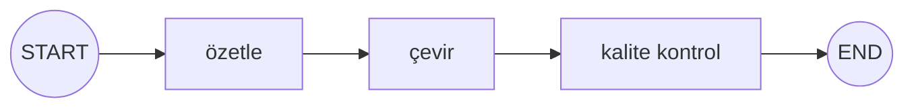
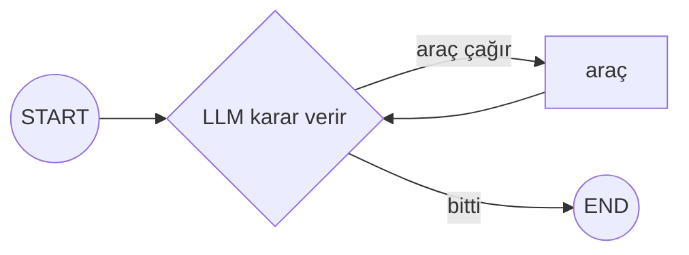

# Workflows vs Agents

🟢 BAŞLANGIÇ

LangChain ekibinin dokümantasyonda sıkça vurguladığı önemli bir ayrım: **workflow** (iş akışı) ile **agent** (ajan) aynı şey değildir. LangGraph'ta bir sistem tasarlarken önce hangisini kurduğunu netleştirmek, mimari kararlarının çoğunu kolaylaştırır.

## Workflow (iş akışı) — önceden tanımlı yol

Bir **workflow**'da adımların sırası **kod tarafından önceden belirlenir**. LLM bir adımda karar verse bile, hangi adımların var olduğu ve genel akış sabittir.

Bu grafta hangi node'ların çalışacağı bellidir — sırayla özetleme, çeviri, kontrol. LLM her adımda "ne yapacağını" değil, "o adımın çıktısını" üretir.

## Agent (ajan) — LLM'in kendi yolunu belirlediği sistem

Bir **agent**'ta ise **hangi adımların, kaç kez, hangi sırayla** çalışacağına LLM karar verir. Kod, olası araçları ve durma koşulunu tanımlar; LLM bu araçları ne zaman ve nasıl kullanacağına kendisi karar verir.

[ToolNode & Hazır Ajanlar](../orta-seviye/tool-node.md) sayfasındaki döngü tam olarak budur — kaç kez araç çağrılacağı, hangi sırayla, önceden belli değildir.

## Neden bu ayrım önemli?

| | Workflow | Agent |
|---|---|---|
| Kontrol | Yüksek — davranış öngörülebilir | Düşük — LLM'in kararına bağlı |
| Esneklik | Düşük — beklenmedik durumlara uyum sağlamaz | Yüksek — yeni durumlara uyum sağlar |
| Test edilebilirlik | Kolay (sabit yol) | Zor (yol değişken) |
| Maliyet öngörülebilirliği | Yüksek | Düşük (kaç LLM çağrısı yapılacağı belirsiz) |
| Ne zaman tercih edilir | Görev adımları net, tekrarlanabilirse | Görev keşif/karar gerektiriyorsa |

!!! tip "Çoğu gerçek sistem ikisinin karışımıdır"
    Production sistemlerinin çoğu **saf workflow** ya da **saf agent** değil, ikisinin karışımıdır: bazı adımlar sabit (workflow), bazı adımlarda LLM karar verir (agent). [Örnek Proje](../ornek-proje/musteri-destek-botu.md)'deki müşteri destek botu tam olarak bu karışımı gösterir — `router` adımı LLM kararı (agent-benzeri), `iade_isle` adımı ise sabit bir işlem (workflow-benzeri). LangGraph'ın gücü tam olarak bu ikisini **aynı grafta** özgürce karıştırabilmenizdir.

---

Sıradaki adım: [Koşullu Kenarlar](kosullu-kenarlar.md).
