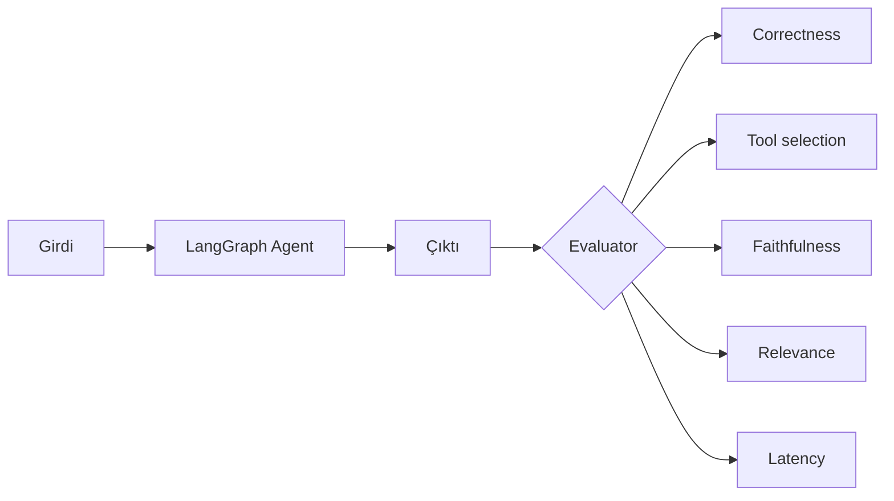
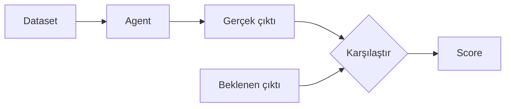
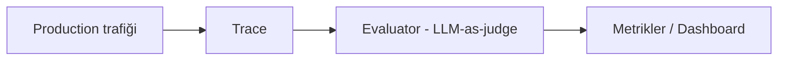

# Ajan Değerlendirme (Evaluation)

<span class="badge badge-ileri">🔴 İLERİ / SENIOR</span>

[Test Yazma](../orta-seviye/testing.md) sayfasında "Katman 4" olarak kısaca değindiğimiz konuyu burada derinleştiriyoruz: **ajanının doğru çalıştığını nasıl ölçersin?** Bir production ajanı için bu, "çalışıyor mu?" sorusundan çok daha zengin bir sorudur.

## Değerlendirme boyutları



- **Correctness (doğruluk)** — cevap gerçekten doğru mu?
- **Tool selection (araç seçimi)** — ajan doğru aracı, doğru parametrelerle çağırdı mı?
- **Faithfulness (bağlılık)** — RAG sistemlerinde cevap, verilen kaynağa sadık mı, yoksa halüsinasyon mu var?
- **Relevance (alaka)** — cevap, sorulan soruyla gerçekten ilgili mi?
- **Latency (gecikme)** — cevap kabul edilebilir sürede mi geldi?

Sadece "doğruluk"a bakmak yeterli değildir — hızlı ama yanlış, ya da doğru ama alakasız bir cevap da başarısızlıktır.

## Offline evaluation — dataset ile test

Sabit bir soru-cevap seti üzerinde, değişiklik yapmadan önce ve sonra karşılaştırma yaparsınız (regresyon testi mantığı, bkz. [Test Yazma](../orta-seviye/testing.md)):



```python
dataset = [
    {"soru": "İade süresi kaç gün?", "beklenen": "14 gün"},
    {"soru": "Kargo ücreti ne kadar?", "beklenen": "ücretsiz"},
]

def degerlendir(agent, dataset):
    dogru = 0
    for ornek in dataset:
        sonuc = agent.invoke({"messages": [("user", ornek["soru"])]})
        cevap = sonuc["messages"][-1].content
        if ornek["beklenen"].lower() in cevap.lower():
            dogru += 1
    return dogru / len(dataset)

skor = degerlendir(app, dataset)
assert skor >= 0.9  # %90 doğruluk eşiği — CI/CD'ye entegre edilebilir
```

Daha büyük ölçekte, bu iş genelde LangSmith'in `evaluate()` fonksiyonuna ya da Langfuse dataset'lerine devredilir (bu araçlar için ayrı bir rehber planlanıyor — bkz. [Kaynaklar](../kaynaklar.md)).

## Online evaluation — gerçek trafik üzerinde

Offline dataset, üretimdeki gerçek çeşitliliği asla tam yakalayamaz. **Online evaluation**, canlı trafiğin bir örneklemini sürekli değerlendirir:



Tipik akış: her N isteğin birini (ör. %5'ini) örnekleyip bir "yargıç" LLM'e (bkz. [LLM-as-judge](../sozluk.md)) göndermek, sonucu bir dashboard'da zaman serisi olarak izlemek. Bu, offline dataset'in yakalayamadığı **drift**'i (kullanıcı davranışının zamanla değişmesi) erken fark etmenizi sağlar.

## Tool selection'ı nasıl değerlendiririz?

RAG/QA sistemlerinden farklı olarak, ajanlarda ölçmeniz gereken bir şey daha var: **doğru aracı mı çağırdı?**

```python
def arac_secimi_dogru_mu(agent_output, beklenen_arac: str) -> bool:
    tool_calls = [m for m in agent_output["messages"] if getattr(m, "tool_calls", None)]
    if not tool_calls:
        return beklenen_arac is None
    cagrilan_araclar = [tc["name"] for m in tool_calls for tc in m.tool_calls]
    return beklenen_arac in cagrilan_araclar
```

Bu, özellikle çok araçlı ajanlarda (bkz. [ToolNode & Hazır Ajanlar](../orta-seviye/tool-node.md)) "doğru cevabı yanlış yoldan mı buldu" sorusunu yakalamanın tek yoludur.

## Offline vs Online — ne zaman hangisi?

| | Offline | Online |
|---|---|---|
| Ne zaman çalıştırılır | Deploy öncesi, CI/CD'de | Sürekli, production'da |
| Neyi yakalar | Bilinen regresyon senaryoları | Gerçek dünyadaki beklenmeyen girdiler |
| Maliyet | Düşük (sabit dataset) | Sürekli (her örnekte LLM çağrısı) |
| Kullanım | "Bu değişiklik kaliteyi bozdu mu?" | "Sistem şu an genel olarak nasıl çalışıyor?" |

!!! tip "İkisi birlikte kullanılır"
    Offline evaluation, deploy'dan **önce** güven verir; online evaluation, deploy'dan **sonra** gözlem sağlar. Sadece birini yapmak, ya regresyonları yakalayamazsınız (sadece online) ya da gerçek dünya çeşitliliğini göremezsiniz (sadece offline).

---

Sıradaki adım: [Ajan Güvenliği](guvenlik.md).
