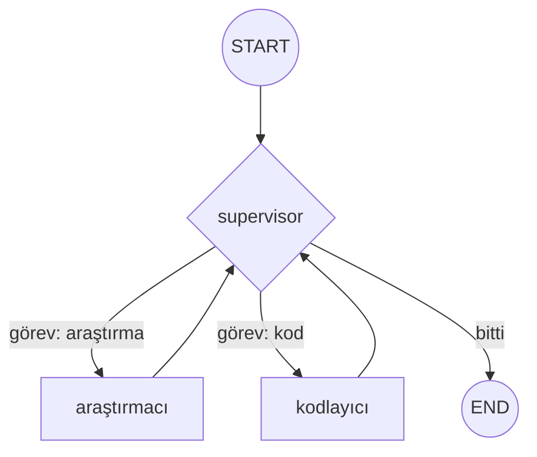
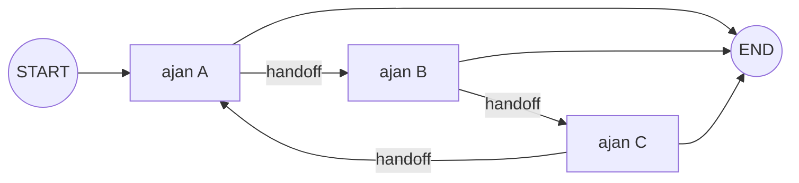
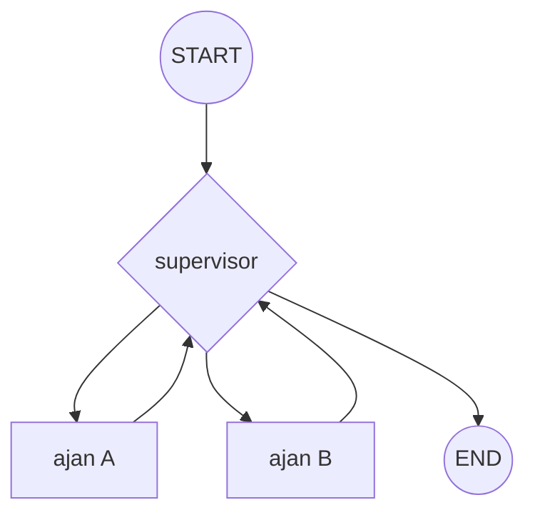
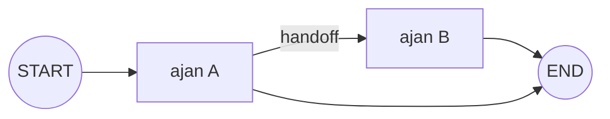

# Multi-Agent Mimarileri

<span class="badge badge-ileri">🔴 İLERİ / SENIOR</span>

Tek bir ajanın tüm araçlara/bağlama sahip olması hem prompt'u şişirir hem de modelin doğru karar verme olasılığını düşürür. Çözüm: görevi uzmanlaşmış ajanlara bölmek.

## Supervisor (yönetici) deseni

Merkezi bir **supervisor** (yönetici/denetleyici) node, görevi hangi uzman ajanın üstleneceğine karar verir. Denetlenebilirlik ve öngörülebilirlik önceliğiyse en yaygın tercihtir.

```python
def supervisor_node(state: State) -> Command[Literal["arastirmaci", "kodlayici", "__end__"]]:
    karar = llm.invoke([
        SystemMessage("Görevi 'arastirmaci', 'kodlayici' ajanlarından birine yönlendir, bitti ise 'FINISH' de."),
        *state["messages"],
    ])
    hedef = karar.content if karar.content != "FINISH" else "__end__"
    return Command(goto=hedef)

graph.add_node("supervisor", supervisor_node)
graph.add_node("arastirmaci", arastirmaci_agent)
graph.add_node("kodlayici", kodlayici_agent)
graph.add_edge("arastirmaci", "supervisor")  # iş bitince supervisor'a raporla
graph.add_edge("kodlayici", "supervisor")
graph.add_edge(START, "supervisor")
```

### Görsel: supervisor deseni



Tüm kararlar `supervisor`'dan geçer — bu yüzden denetlenebilirliği yüksektir.

!!! warning "langgraph_supervisor paketi ve subagents deseni"
    Bir süre `langgraph_supervisor` paketi (`create_supervisor` fonksiyonu) bu deseni hazır sağlıyordu. **Bu paket artık aktif olarak bakımda değil.** Güncel önerilen yaklaşım, worker ajanları `@tool` olarak sarıp bir ana `create_agent`'a bağlayan **subagents deseni**:

```python
from langchain.agents import create_agent
from langchain.tools import tool

@tool
def arastirmaciya_devret(soru: str) -> str:
    """Araştırma gerektiren sorular için bu aracı kullan."""
    arastirma_ajani = create_agent(model=llm, tools=[web_arama])
    sonuc = arastirma_ajani.invoke({"messages": [("user", soru)]})
    return sonuc["messages"][-1].content

@tool
def kodlayiciya_devret(gorev: str) -> str:
    """Kod yazma/çalıştırma gerektiren görevler için bu aracı kullan."""
    kod_ajani = create_agent(model=llm, tools=[kod_calistir])
    sonuc = kod_ajani.invoke({"messages": [("user", gorev)]})
    return sonuc["messages"][-1].content

ana_ajan = create_agent(model=llm, tools=[arastirmaciya_devret, kodlayiciya_devret])
```

    Mantık aynı kalıyor — bir "yönetici" hangi uzmana devredeceğine karar veriyor — ama artık bu devir, ayrı bir supervisor paketi yerine normal bir **araç çağırma** mekanizmasıyla ifade ediliyor. Elle `StateGraph` ile kurduğunuz supervisor deseni (yukarıdaki `Command` örneği) hâlâ tamamen geçerli ve destekleniyor.

## Swarm deseni

**Swarm** (sürü) deseninde merkezi bir yönetici yok — ajanlar birbirine doğrudan **devir** (*handoff*) yapar; her ajan "kime devredeyim" kararını kendisi verir (genelde bir "handoff" aracı çağırarak).

### Görsel: swarm deseni



Merkezi bir düğüm yok — her ajan sıradaki ajana kendi kararıyla devrediyor.

## Görsel karşılaştırma: Supervisor vs Swarm

<div class="diagram-compare" markdown="1">
<div markdown="1">
#### Supervisor — merkezi karar



Her karar `supervisor`'dan geçer — tek bir noktadan izlenebilir.
</div>
<div markdown="1">
#### Swarm — dağıtık karar



Merkezi bir düğüm yok — karar her ajanın kendi içinde dağıtık.
</div>
</div>

| | Supervisor | Swarm |
|---|---|---|
| Denetlenebilirlik | Yüksek (tüm kararlar tek yerden geçer) | Düşük — takip etmesi zor olabilir |
| Esneklik | Orta | Yüksek — ajanlar organik olarak işbirliği yapar |
| Debug kolaylığı | Kolay | Zor |
| Önerilen kullanım | Kurumsal/regüle iş akışları | Araştırma, keşif odaklı sistemler |

## Hiyerarşik (nested) mimari

Büyük sistemlerde bir supervisor'ın kendisi de başka bir üst supervisor'a bağlı bir "takım" olabilir — [subgraph](../orta-seviye/subgraph-store.md) mekanizmasıyla doğal olarak modellenir. Ör: "İçerik Takımı" (araştırmacı + yazar) ve "Kod Takımı" (mimar + geliştirici + test uzmanı), ikisi de "Genel Müdür" supervisor'a bağlı.

!!! tip "Mimari seçim kılavuzu"
    - Görev sınırları net ve denetim önemliyse → **supervisor**
    - Ajanlar arası organik işbirliği, keşif odaklı görevler → **swarm**
    - Sistem büyüdükçe → **hiyerarşik** (supervisor'lar arası supervisor)

## Ne zaman multi-agent kullanmamalıyım?

Multi-agent mimarisi son dönemde çok popüler oldu ve bazen gerçekten gerekmediği yerlerde de kuruluyor. Şu soruyu kendine sor: **tek bir ajan + birkaç araç bu problemi çözebiliyor mu?**

Eğer cevap evet ise, multi-agent'a geçmek genelde şunları getirir:

- **Gereksiz karmaşıklık**: ajanlar arası mesajlaşma/devir mantığını debug etmek, tek ajanın araç seçimini debug etmekten çok daha zordur
- **Daha fazla LLM çağrısı, daha yüksek maliyet**: her devir (handoff) ek bir LLM turudur
- **Daha öngörülemez davranış**: ajan sayısı arttıkça toplam sistemin davranışını tahmin etmek zorlaşır

Multi-agent'a geçmeyi düşünmen gereken gerçek sinyaller: tek bir ajanın prompt'u çok şişmiş ve birbirine karışan sorumluluklar taşıyor, ya da gerçekten farklı uzmanlık alanları (farklı araç setleri, farklı sistem promptları) net bir şekilde ayrışıyor. Bu sinyaller yoksa, [ToolNode & Hazır Ajanlar](../orta-seviye/tool-node.md)'da anlatılan tek-ajan deseni genelde daha az kod, daha az maliyet ve daha kolay debug ile aynı işi görür.

---

Sıradaki adım: hataları ve kararları geriye dönük incelemek için [Time Travel & Debugging](time-travel.md).
