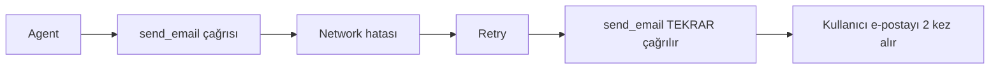

# Production & Deployment

<span class="badge badge-ileri">🔴 İLERİ / SENIOR</span>

## Durable execution (dayanıklı çalıştırma) — genel çerçeve

**Durable execution**, bir workflow'un kesinti veya hata sonrasında güvenilir biçimde kaldığı yerden devam edebilmesini sağlayan çalışma modelidir. Bu, tek bir mekanizma değil, birkaç mekanizmanın **birlikte** oluşturduğu bir özelliktir:

1. **[Checkpointer](../orta-seviye/checkpointer.md)** — her adımdan sonra state'i kalıcı olarak kaydeder
2. **Retry policy** (aşağıda) — geçici hatalarda otomatik yeniden dener
3. **Idempotent side effect'ler** (aşağıda) — bir işlem tekrarlansa bile aynı sonucu üretir
4. **[Human-in-the-loop](../orta-seviye/human-in-the-loop.md)** — beklenen "duraklamaları" (insan onayı) yönetir

!!! note "Retry tek başına durable execution değildir"
    Bu dördü **birlikte** dayanıklılığı oluşturur — sadece retry eklemek yeterli değildir. Örneğin checkpointer olmadan retry, kaldığınız yerden değil baştan başlar; idempotency olmadan retry, bir ödeme işlemini iki kez tetikleyebilir (bkz. aşağıdaki Idempotency bölümü).

Bu dört bileşen birlikte düşünüldüğünde, "production'a hazır mıyım?" sorusu aslında "çalıştırmam gerçekten dayanıklı mı?" sorusuna dönüşür.

## Hata yönetimi ve retry

Harici API çağıran node'larda geçici hataları (rate limit, network) tolere etmek için node bazlı **retry policy** (yeniden deneme politikası) tanımlayın:

```python
from langgraph.types import RetryPolicy

graph.add_node(
    "arac_cagir",
    arac_node,
    retry_policy=RetryPolicy(max_attempts=3),
)
```

!!! note "max_attempts ne anlama gelir?"
    `max_attempts=3`, **ilk deneme dahil toplam 3 deneme** demektir (1. deneme başarısız → 2. deneme başarısız → 3. deneme). "3 kez daha dene" değildir. Varsayılan olarak `RetryPolicy`, `ValueError`, `TypeError` gibi programlama hatları hariç çoğu exception'da devreye girer.

## error_handler — retry'lar tükendikten sonra kurtarma

!!! info "langgraph>=1.2 gerektirir"
    Bu özellik LangGraph 1.2 ve üzeri sürümlerde mevcuttur.

Retry'lar tükendiğinde node hâlâ başarısızsa, LangGraph bir **kurtarma fonksiyonu** çalıştırmanıza izin verir — özellikle "ödeme başarısız oldu, stoktan düşürdüğüm ürünü geri ekle" gibi telafi (Saga/compensation) senaryolarında değerlidir:

```python
from langgraph.errors import NodeError
from langgraph.types import Command

def odeme_kurtarma(state: State, error: NodeError) -> Command:
    return Command(update={
        "durum": f"'{error.node}' düğümü başarısız oldu, stok telafi ediliyor",
    }, goto="stok_telafi")

graph.add_node(
    "odeme_al",
    odeme_node,
    retry_policy=RetryPolicy(max_attempts=3),
    error_handler=odeme_kurtarma,
)
```

`error_handler`, tükenen retry'lardan sonra çalışır ve tipli bir `NodeError` (`error.node`, `error.error`) alır; `Command` döndürerek hem state'i güncelleyebilir hem de farklı bir node'a yönlendirebilir.

## Recursion limit (döngü üst sınırı)

Döngüsel graflarda sonsuz döngüyü önlemek için üst sınır koyun — özellikle multi-agent sistemlerde kritik:

```python
app.invoke(input, config={"recursion_limit": 25})
```

## Timeout

Bir node içindeki harici çağrı (LLM, araç, veritabanı, HTTP isteği) asılı kalırsa, tüm grafın çalışması da asılı kalır. Her dış çağrı türü için ayrı bir zaman aşımı düşünülmeli:

| Timeout türü | Tipik değer | Neden gerekli |
|---|---|---|
| **LLM timeout** | 30-60 sn | Model sağlayıcısı yanıt vermezse graf sonsuza kadar beklemesin |
| **Tool timeout** | Araca göre değişir | Harici bir API'nin yanıt vermemesi tüm ajanı kilitlemesin |
| **Database timeout** | 5-10 sn | Yavaş bir sorgu, kullanıcı deneyimini komple bloke etmesin |
| **HTTP timeout** | 10-30 sn | Üçüncü parti servisler her zaman güvenilir değildir |

```python
from langchain_openai import ChatOpenAI

llm = ChatOpenAI(model="gpt-4o-mini", timeout=30, max_retries=2)

@tool
def harici_api_cagir(sorgu: str) -> str:
    """Harici bir API'ye zaman aşımıyla istek atar."""
    response = requests.get(API_URL, params={"q": sorgu}, timeout=10)
    return response.text
```

### LangGraph'ın native node-level timeout'u

!!! info "langgraph>=1.2 gerektirir, sadece async node'larda çalışır"
    Yukarıdaki örnekler (LLM istemcisi, `requests`) **kütüphane seviyesinde** timeout'lardır — her zaman çalışır. LangGraph ayrıca `add_node`'a doğrudan `timeout=` parametresi ekleyerek **node'un tamamını** sarabilir; ama bu **yalnızca async node'larda** desteklenir (senkron bir node'a `timeout` vermek derleme anında hataya yol açar).

```python
from datetime import timedelta
from langgraph.types import TimeoutPolicy

# Basit sabit süre
graph.add_node("model_cagir", model_cagir, timeout=60)
graph.add_node("model_cagir", model_cagir, timeout=timedelta(minutes=2))

# Ayrı "toplam süre" ve "hareketsizlik" limitleri
graph.add_node(
    "model_cagir",
    model_cagir,
    timeout=TimeoutPolicy(run_timeout=120, idle_timeout=30),
)
```

Süre dolduğunda LangGraph `NodeTimeoutError` fırlatır, o denemenin yazımlarını temizler ve devreyi retry policy'ye devreder — yani timeout ve retry burada da birlikte çalışır.

!!! tip "Timeout, RetryPolicy ile birlikte çalışır"
    Timeout "ne kadar beklerim" sorusunu, RetryPolicy (yukarıdaki "Hata yönetimi ve retry" bölümü) "başarısız olursa kaç kez tekrar denerim" sorusunu cevaplar. İkisi birlikte kullanılır: `timeout=30, retry_policy=RetryPolicy(max_attempts=3)` — her denemede 30 saniye bekle, toplamda 3 deneme yap.

## Idempotency (aynı işlemi güvenle tekrarlama)

Bir node **retry** edildiğinde ya da checkpointer sayesinde **kaldığı yerden devam** ettiğinde, bazı adımların **iki kez çalışması** ciddi sorunlara yol açabilir:



E-posta gönderme, ödeme alma, sipariş oluşturma gibi **yan etkisi olan** (side-effect) işlemler, bir node içinde retry'a uğradığında aynı işlemi ikinci kez tetikleyebilir. Buna karşı iki yaygın çözüm:

**1. Idempotency key (işlem kimliği) ile koruma**

```python
@tool
def odeme_al(tutar: float, islem_id: str) -> str:
    """Aynı islem_id ile tekrar çağrılırsa işlemi tekrar yapmaz."""
    if odeme_sistemi.islem_var_mi(islem_id):
        return odeme_sistemi.sonucu_getir(islem_id)
    return odeme_sistemi.odeme_yap(tutar, islem_id=islem_id)
```

`islem_id`, o node'un o çalıştırmasına özel sabit bir değerdir (ör. `thread_id` + adım numarası) — aynı `islem_id` ile ikinci bir çağrı geldiğinde, işlem sistemi bunu "zaten yapıldı" olarak tanır ve tekrar etmez.

**2. Yan etkili işlemleri human-in-the-loop ile koru**

Geri alınamaz işlemler için [interrupt](../orta-seviye/human-in-the-loop.md) kullanarak, retry mantığının insanın onayı olmadan tekrar tetiklenmesini engelleyin.

!!! warning "Hangi node'lar risk taşır?"
    Sadece **veri okuyan** node'lar (bir şey sorgulayan, hesaplayan) idempotency sorunu taşımaz — istediğiniz kadar tekrar çalışabilirler. Risk, **yan etkisi olan** (para transferi, e-posta, harici sisteme yazma) node'lardadır. Bu tür node'ları tasarlarken "bu iki kez çalışırsa ne olur?" sorusunu her zaman sorun.

## Observability — gün 1'den itibaren kurun

Production'da neyin, neden yanlış gittiğini görmeden debug etmek neredeyse imkansızdır.

```python
import os
os.environ["LANGCHAIN_TRACING_V2"] = "true"
os.environ["LANGCHAIN_PROJECT"] = "bot-prod"
# app.invoke() çağrıları otomatik olarak LangSmith'e trace gönderir
```

Alternatif/tamamlayıcı olarak Langfuse `CallbackHandler` da grafın her node'unu ayrı span olarak izler.

## Checkpointer backend'i

`InMemorySaver` sadece geliştirme içindir. Production'da Postgres veya Redis tabanlı kalıcı bir checkpointer kullanın (bkz. [Checkpointer sayfası](../orta-seviye/checkpointer.md)) — süreç yeniden başladığında tüm konuşma geçmişini kaybetmemek için şarttır.

## Node-level caching (maliyet/performans optimizasyonu)

Aynı girdiyle tekrar tekrar çağrılan, pahalı ya da yavaş bir node varsa (ör. aynı belgeyi tekrar özetlemek, aynı hesaplamayı tekrar yapmak), sonucu önbelleğe alabilirsiniz:

```python
from langgraph.cache.memory import InMemoryCache
from langgraph.types import CachePolicy

graph.add_node(
    "belge_ozetle",
    ozetle_node,
    cache_policy=CachePolicy(ttl=120),  # saniye cinsinden — None ise süresiz
)

app = builder.compile(cache=InMemoryCache())
```

Aynı girdiyle yapılan ikinci çağrı, node'u tekrar çalıştırmak yerine önbellekten döner — hem LLM maliyetini hem de gecikmeyi düşürür. Production'da `InMemoryCache` yerine Redis tabanlı bir cache backend'i tercih edilmelidir (checkpointer'daki aynı "sadece dev" uyarısı burada da geçerlidir).

!!! warning "Cache, yan etkili node'lar için uygun değildir"
    Caching, sadece **saf** (aynı girdi → her zaman aynı çıktı, yan etkisiz) node'lar için güvenlidir. Bir ödeme işlemini ya da e-posta gönderimini önbelleğe almayın — bu, [idempotency](#idempotency-ayn-islemi-guvenle-tekrarlama) beklediğiniz davranışın tam tersi bir sonuca yol açabilir.

## Deployment seçenekleri

| Seçenek | Ne zaman uygun |
|---|---|
| **LangGraph Platform** (managed) | Hızlı başlamak, altyapı yönetmek istemiyorsanız |
| **Kendi FastAPI sarmalayıcınız** | Tam kontrol, mevcut altyapınıza entegrasyon |
| **Docker + Kubernetes** | Kurumsal ölçek, çoklu ortam |

Basit bir FastAPI sarmalayıcı örneği:

```python
from fastapi import FastAPI
from pydantic import BaseModel

app_api = FastAPI()

class Istek(BaseModel):
    mesaj: str
    thread_id: str

@app_api.post("/sohbet")
def sohbet(istek: Istek):
    config = {"configurable": {"thread_id": istek.thread_id}}
    sonuc = app.invoke({"messages": [("user", istek.mesaj)]}, config)
    return {"cevap": sonuc["messages"][-1].content}
```

## Maliyet ve performans kontrol listesi

- [ ] Her döngü turunun token maliyetini biliyor musunuz? `recursion_limit` koydunuz mu?
- [ ] Checkpointer prod'da kalıcı bir backend'e mi bağlı?
- [ ] Trace'leriniz node bazında etiketli mi (hangi ajan/adım neye mal oluyor)?
- [ ] Kritik/geri alınamaz aksiyonlar için [human-in-the-loop](../orta-seviye/human-in-the-loop.md) var mı?
- [ ] Harici API çağıran node'larda retry/timeout tanımlı mı?
- [ ] Yan etkisi olan (ödeme, e-posta, veri yazma) node'lar idempotent mi — iki kez çalışsa sorun olur mu?

---

Bu, production temellerinin son sayfasıdır. Ajanının doğru çalıştığını nasıl ölçeceğin için: [Ajan Değerlendirme](degerlendirme.md).

📄 Bu seviyenin özetini PDF olarak indir: [İleri Seviye Cheatsheet](../assets/cheatsheets/langgraph-ileri-seviye-cheatsheet.pdf)
