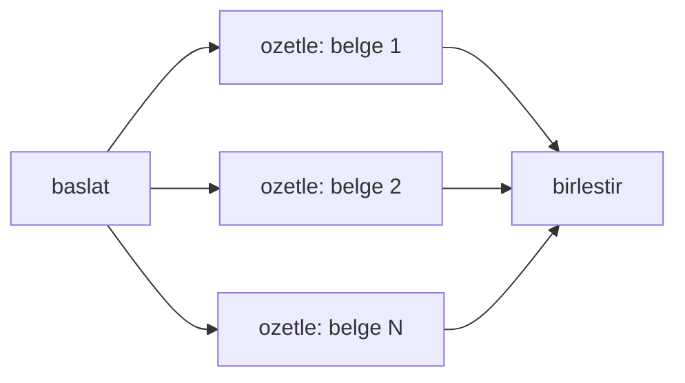

# Command & Send API

<span class="badge badge-ileri">🔴 İLERİ / SENIOR</span>

## Command — yönlendirme + state güncelleme tek objede

Normalde bir node'un çıktısı sadece state günceller; sıradaki node'u `add_conditional_edges` belirler. **Command** (komut) ile bir node, **hem state'i güncelleyip hem de sıradaki node'u** tek seferde belirleyebilir — ayrı bir routing fonksiyonu yazmanıza gerek kalmaz.

```python
from langgraph.types import Command
from typing import Literal

def router_node(state: State) -> Command[Literal["arastirmaci", "yazar"]]:
    hedef = "arastirmaci" if state["gorev_tipi"] == "arastirma" else "yazar"
    return Command(
        goto=hedef,
        update={"yonlendirme_notu": f"{hedef}'a yönlendirildi"},
    )
```

Bu, özellikle [multi-agent](multi-agent.md) sistemlerde bir "supervisor" node'un kararını ifade etmek için doğal bir yoldur.

### Subgraph'lar arası Command

`Command(goto=..., graph=Command.PARENT)` ile bir subgraph'ın içinden, ana grafta bir node'a doğrudan atlayabilirsiniz — hiyerarşik ajan sistemlerinde sık kullanılır.

## Send API — dinamik paralel dağıtım (map-reduce)

Bazı görevlerde kaç paralel dal açılacağı **çalışma zamanında** belli olur — ör. kullanıcının yüklediği N adet belgeyi paralel özetlemek. **Send** (gönder), tam olarak bu **map-reduce** ("dağıt-topla") deseni için tasarlanmıştır: *map* aşaması işi paralel dallara dağıtır, *reduce* aşaması sonuçları birleştirir.

```python
from langgraph.types import Send

def dagit(state: State):
    return [Send("ozetle", {"belge": b}) for b in state["belgeler"]]

graph.add_conditional_edges("baslat", dagit, ["ozetle"])
graph.add_node("ozetle", ozetle_node)
graph.add_node("birlestir", birlestir_node)
graph.add_edge("ozetle", "birlestir")
```

Her `Send("ozetle", {...})`, `ozetle` node'unun **ayrı bir kopyasını, kendi state'iyle** çalıştırır. Tüm dallar bittiğinde sonuçlar `birlestir` node'unda toplanır (state'teki liste alanı bir reducer ile otomatik birleştirilir).

!!! note "\"Paralel\" ifadesi hakkında"
    Buradaki "paralel" kelimesi, gerçek Python thread/process paralelliği anlamına gelmez. `Send` çalışma zamanında birden fazla bağımsız fan-out dalı oluşturur; LangGraph bu dalları kendi graf yürütme modelinin (Pregel) bir parçası olarak, adım adım (super-step) işler. Yani kavramsal olarak "aynı anda birden fazla iş" hissi verir, ama işletim sistemi seviyesinde thread paralelliğiyle karıştırılmamalıdır.

### Görsel: map-reduce akışı



`baslat` düğümünden çıkan dal sayısı, `state["belgeler"]` listesinin uzunluğuna göre **çalışma zamanında** belirlenir.

!!! example "Tipik kullanım: doküman analizi pipeline'ı"
    100 sayfalık bir PDF'i bölümlere ayırıp her bölümü paralel özetleyip sonunda tek bir genel özet üretmek — klasik bir map-reduce deseni, `Send` ile birkaç satırda kurulur.

---

Sıradaki adım: [State Tasarımı](state-tasarimi.md) — grafını kurmadan önce state'ini nasıl tasarlaman gerektiğini gör.
