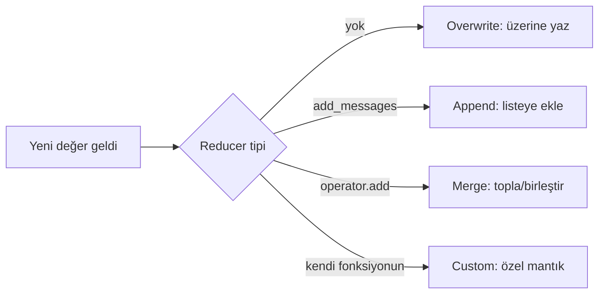

# State Tasarımı

<span class="badge badge-ileri">🔴 İLERİ / SENIOR</span>

[Temel Kavramlar](../baslangic/temel-kavramlar.md)'da state'in ne olduğunu öğrendik. Bu sayfa bir adım öteye geçiyor: **state'i nasıl tasarlamalısın?** Bu soru, küçük bir prototipte önemsiz görünür ama sistem büyüdükçe en çok teknik borcun biriktiği yer haline gelir.

## Kötü vs iyi state tasarımı

```python
# ❌ Kötü — her şey tek bir esnek alanda
class State(TypedDict):
    data: dict
```

```python
# ✅ İyi — her alan neyi temsil ettiğini açıkça söylüyor
class State(TypedDict):
    messages: Annotated[list, add_messages]
    user_id: str
    query: str
    documents: list[str]
    answer: str
    confidence_score: float
```

`data: dict` gibi bir tasarım kısa vadede esnek görünür ama şu maliyetleri getirir: hangi anahtarların ne zaman dolu olduğu koddan anlaşılmaz, tip kontrolü tamamen kaybolur, ve bir node `data["cevap"]` yazarken başka biri `data["answer"]` bekleyebilir — hata çalışma zamanına kadar fark edilmez.

## Hangi veriler state'te, hangileri Store'da olmalı?

Bu, [Store](../orta-seviye/subgraph-store.md) sayfasındaki kısa/uzun süreli hafıza ayrımının pratik uygulamasıdır:

| Soru | Cevap evet ise → |
|---|---|
| Bu bilgi sadece **bu konuşmada** mı anlamlı? | **State** |
| Bu bilgi **thread'ler arası** hatırlanmalı mı (kullanıcı tercihi gibi)? | **Store** |
| Bu bilgi **çok büyük** (ör. tam bir PDF metni, binlerce satır veri)? | Ne ikisi de değil — dış depoya (S3, veritabanı) yaz, state'e sadece **referans/ID** koy |

!!! warning "Büyük objeleri state'te tutmanın maliyeti"
    State, her adımda [checkpointer](../orta-seviye/checkpointer.md) tarafından **serileştirilip kaydedilir**. State'e 5 MB'lık bir PDF metni koyarsanız, bu veri her tek adımda yeniden yazılır — hem depolama maliyeti hem de her `invoke`/`stream` çağrısının gecikmesi artar. Büyük veriler için state'e sadece bir dosya yolu/ID tutun, veriyi ayrı bir depoda saklayın.

## Reducer stratejileri

[Temel Kavramlar](../baslangic/temel-kavramlar.md)'da tek bir reducer (`add_messages`) gördük. Aslında dört temel strateji var:



**1. Overwrite (üzerine yazma)** — reducer tanımlanmazsa varsayılan davranış:
```python
class State(TypedDict):
    answer: str  # her node bu alanı tamamen değiştirir
```

**2. Append (listeye ekleme)** — mesaj geçmişi gibi büyüyen veriler:
```python
messages: Annotated[list, add_messages]
```

**3. Merge (toplama/birleştirme)** — [Send](../ileri-seviye/send-command.md) ile paralel dallardan gelen sayısal/liste sonuçları toplamak için:
```python
import operator
sonuclar: Annotated[list, operator.add]  # paralel dallardan gelen listeler birleşir
```

**4. Custom reducer (özel mantık)** — kendi birleştirme kuralınızı yazmak:
```python
def en_yuksek_skoru_tut(eski: float, yeni: float) -> float:
    return max(eski, yeni)

en_iyi_skor: Annotated[float, en_yuksek_skoru_tut]
```

!!! tip "Reducer seçimi = veri tipi kararı"
    Bir state alanı **her adımda tamamen değişiyorsa** → reducer'a gerek yok (overwrite). **Zamanla büyüyorsa** (liste, geçmiş) → append/merge reducer'ı. **Birden fazla paralel daldan aynı anda güncelleniyorsa** → mutlaka bir reducer gerekir, yoksa `INVALID_CONCURRENT_GRAPH_UPDATE` hatası alırsınız (bkz. [Hata Referansı](../referans/hata-referansi.md)).

## Senior kontrol listesi

- [ ] State şeması, her alanın ne anlama geldiğini isimden anlaşılır kılıyor mu (`data` gibi belirsiz isimler yok)?
- [ ] Büyük/binary veriler state'te değil, dış depoda mı tutuluyor?
- [ ] Paralel dallardan güncellenen her alanda bir reducer tanımlı mı?
- [ ] State'i thread'ler arası mı yoksa tek konuşmaya mı ait olduğu net mi (State vs Store kararı)?

---

Sıradaki adım: [Multi-Agent Mimarileri](multi-agent.md).
