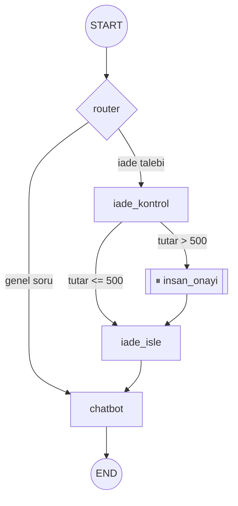

# Örnek Proje — Müşteri Destek Botu (uçtan uca)

<span class="badge badge-ileri">🔴 İLERİ / SENIOR</span>

Bu sayfada, rehberde tek tek öğrendiğimiz parçaları (state, ToolNode, checkpointer, human-in-the-loop, config injection, deployment) **tek bir gerçekçi projede** birleştiriyoruz: konuşma geçmişini hatırlayan, iade taleplerini işleyebilen, büyük tutarlı iadeleri insan onayına düşüren bir müşteri destek botu.

## Ne kuracağız?



- **router**: gelen mesajın genel bir soru mu yoksa iade talebi mi olduğuna karar verir ([Command & Send API](../ileri-seviye/send-command.md))
- **iade_kontrol**: tutara göre otomatik mi geçecek yoksa onaya mı düşecek karar verir ([NodeInterrupt](../orta-seviye/human-in-the-loop.md))
- **checkpointer**: her kullanıcının konuşma geçmişini ayrı `thread_id` ile saklar ([Checkpointer](../orta-seviye/checkpointer.md))

## 1. State ve bağımlılıklar

```python
from typing import TypedDict, Annotated, Literal
from langgraph.graph.message import add_messages
from langgraph.graph import StateGraph, START, END
from langgraph.types import Command
from langgraph.errors import NodeInterrupt
from langgraph.checkpoint.postgres import PostgresSaver
from langchain_core.runnables import RunnableConfig
from langchain_openai import ChatOpenAI

class State(TypedDict):
    messages: Annotated[list, add_messages]
    iade_tutari: float | None

llm = ChatOpenAI(model="gpt-4o-mini")
ONAY_ESIGI = 500  # TL — bu tutarın üzeri insan onayına düşer
```

## 2. Router — genel soru mu, iade mi?

```python
def router(state: State) -> Command[Literal["chatbot", "iade_kontrol"]]:
    son_mesaj = state["messages"][-1].content
    karar = llm.invoke([
        ("system", "Kullanıcı mesajı bir iade talebi mi? Sadece 'iade' veya 'genel' yaz."),
        ("human", son_mesaj),
    ])
    hedef = "iade_kontrol" if "iade" in karar.content.lower() else "chatbot"
    return Command(goto=hedef)
```

## 3. İade kontrolü — koşullu human-in-the-loop

```python
def iade_kontrol(state: State):
    tutar = state.get("iade_tutari", 0)
    if tutar > ONAY_ESIGI:
        raise NodeInterrupt(f"{tutar} TL, {ONAY_ESIGI} TL onay eşiğini aşıyor — insan onayı gerekli")
    return {}

def iade_isle(state: State):
    tutar = state.get("iade_tutari", 0)
    return {"messages": [("assistant", f"{tutar} TL iadeniz işleme alındı.")]}
```

`iade_tutari` küçükse `iade_kontrol` sessizce geçer; büyükse `NodeInterrupt` fırlatır ve graf orada durur — bkz. [NodeInterrupt detayları](../orta-seviye/human-in-the-loop.md).

## 4. Genel sohbet node'u — config'ten kullanıcı bilgisi okuma

```python
def chatbot(state: State, config: RunnableConfig):
    kullanici_id = config["configurable"].get("kullanici_id", "bilinmiyor")
    yanit = llm.invoke([
        ("system", f"Sen bir müşteri destek asistanısın. Kullanıcı: {kullanici_id}"),
        *state["messages"],
    ])
    return {"messages": [yanit]}
```

Config injection detayları: [Config & Context Injection](../orta-seviye/context-config.md).

## 5. Grafı kur ve derle

```python
builder = StateGraph(State)
builder.add_node("router", router)
builder.add_node("chatbot", chatbot)
builder.add_node("iade_kontrol", iade_kontrol)
builder.add_node("iade_isle", iade_isle)

builder.add_edge(START, "router")
builder.add_edge("iade_kontrol", "iade_isle")
builder.add_edge("iade_isle", "chatbot")
builder.add_edge("chatbot", END)

with PostgresSaver.from_conn_string(DB_URI) as checkpointer:
    checkpointer.setup()
    app = builder.compile(checkpointer=checkpointer)
```

## 6. Çalıştırma

```python
config = {"configurable": {"thread_id": "sohbet-42", "kullanici_id": "u-123"}}

# Normal soru — chatbot'a gider, direkt cevaplanır
app.invoke({"messages": [("user", "Kargom ne zaman gelir?")]}, config)

# Küçük tutarlı iade — otomatik işlenir
app.invoke({"messages": [("user", "İade istiyorum")], "iade_tutari": 150}, config)

# Büyük tutarlı iade — NodeInterrupt ile durur
app.invoke({"messages": [("user", "İade istiyorum")], "iade_tutari": 2000}, config)
# ... operatör onayı sonrası ...
app.invoke(None, config)  # kaldığı yerden devam
```

## 7. FastAPI'ye sarma

```python
from fastapi import FastAPI
from pydantic import BaseModel

api = FastAPI()

class Istek(BaseModel):
    mesaj: str
    thread_id: str
    kullanici_id: str
    iade_tutari: float | None = None

@api.post("/sohbet")
def sohbet(istek: Istek):
    config = {"configurable": {"thread_id": istek.thread_id, "kullanici_id": istek.kullanici_id}}
    girdi = {"messages": [("user", istek.mesaj)], "iade_tutari": istek.iade_tutari}
    sonuc = app.invoke(girdi, config)
    return {"cevap": sonuc["messages"][-1].content}
```

Deployment seçenekleri (kendi sarmalayıcı vs. LangGraph Platform) için: [Production & Deployment](../ileri-seviye/production.md) ve [langgraph.json & CLI](../ileri-seviye/deployment-cli.md).

## 8. Test etme

```python
from langgraph.checkpoint.memory import MemorySaver

def test_kucuk_tutar_otomatik_geciyor():
    test_app = builder.compile(checkpointer=MemorySaver())
    config = {"configurable": {"thread_id": "test-1", "kullanici_id": "test-user"}}
    sonuc = test_app.invoke(
        {"messages": [("user", "iade istiyorum")], "iade_tutari": 100}, config
    )
    assert "işleme alındı" in sonuc["messages"][-1].content

def test_buyuk_tutar_durur():
    test_app = builder.compile(checkpointer=MemorySaver())
    config = {"configurable": {"thread_id": "test-2", "kullanici_id": "test-user"}}
    sonuc = test_app.invoke(
        {"messages": [("user", "iade istiyorum")], "iade_tutari": 5000}, config
    )
    # Graf durdu, henüz "işleme alındı" mesajı yok
    durum = test_app.get_state(config)
    assert durum.next  # sıradaki adım hâlâ bekliyor
```

Test yazma desenleri için: [Test Yazma](../orta-seviye/testing.md).

## Geliştirme fikirleri

Bu örneği kendi projende genişletmek istersen:

- **Store ekle**: kullanıcının geçmiş iade taleplerini [anlamsal arama destekli Store](../orta-seviye/subgraph-store.md) ile hatırlat.
- **Streaming ekle**: `chatbot` cevabını [token token akıt](../orta-seviye/streaming.md), kullanıcı "yazıyor..." efekti görsün.
- **Multi-agent'a böl**: iade, kargo takibi, genel soru gibi konuları ayrı uzman ajanlara böl — bkz. [Multi-Agent Mimarileri](../ileri-seviye/multi-agent.md) (supervisor deseni).
- **Observability ekle**: LangSmith/Langfuse trace'leriyle her kararı izlenebilir hale getir.

---

📄 Bu örnek, rehberin tüm seviyelerinden kavram kullanır — takıldığın bir noktada [ana sayfadaki cheatsheet'lere](../index.md) veya [alıştırma sorularına](../alistirmalar/baslangic-sorulari.md) göz atabilirsin.
