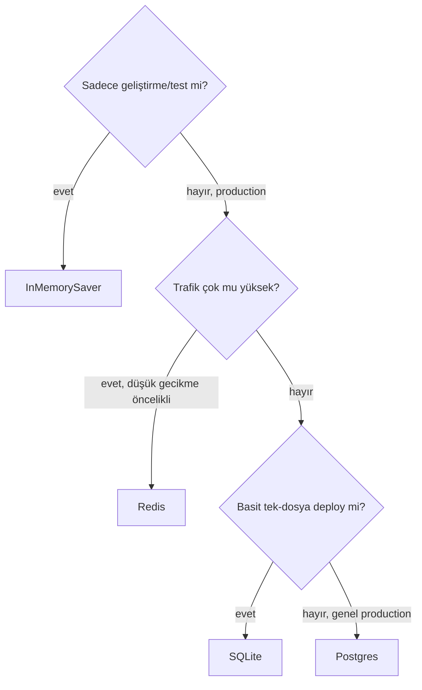

# Checkpointer & Kalıcılık

<span class="badge badge-orta">🟡 ORTA SEVİYE</span>

**Checkpointer** (kontrol noktası kaydedici), grafın her adımdan sonraki state'ini kalıcı olarak kaydeden bileşendir. Bu sayede:

- Kesintiden sonra kaldığı yerden devam edebilirsiniz
- Aynı "thread" (konuşma) için geçmişi hatırlarsınız
- [Human-in-the-loop](human-in-the-loop.md) ve [time-travel](../ileri-seviye/time-travel.md) mümkün olur

## Geliştirme: InMemorySaver

!!! note "İsim notu"
    Bu sınıf eskiden `MemorySaver` olarak biliniyordu; güncel LangGraph sürümlerinde adı `InMemorySaver` — internette hâlâ eski isimle yazılmış kod/tutorial görebilirsin, işlevi aynı.

```python
from langgraph.checkpoint.memory import InMemorySaver

app = graph.compile(checkpointer=InMemorySaver())

config = {"configurable": {"thread_id": "kullanici-42"}}
app.invoke({"messages": [("user", "merhaba")]}, config)
app.invoke({"messages": [("user", "adımı hatırlıyor musun?")]}, config)
```

`thread_id`, hangi konuşmaya ait olduğunu belirtir — aynı `thread_id` ile yapılan her `invoke` çağrısı, önceki state'in üzerine devam eder. **Thread** (burada "iş parçacığı" değil, "tek bir konuşma dizisi" anlamındadır) kavramı, farklı kullanıcıların/oturumların birbirine karışmadan ayrı state tutmasını sağlar.

!!! danger "InMemorySaver sadece geliştirme içindir"
    `InMemorySaver`, state'i sadece bellekte tutar — süreç yeniden başladığında **tüm veri kaybolur**. Production'da mutlaka kalıcı bir backend kullanın.

## Production: Postgres / SQLite

=== "Postgres"

    ```python
    from langgraph.checkpoint.postgres import PostgresSaver

    with PostgresSaver.from_conn_string(DB_URI) as checkpointer:
        checkpointer.setup()  # ilk çalıştırmada tabloları oluşturur
        app = graph.compile(checkpointer=checkpointer)
    ```

=== "SQLite"

    ```python
    from langgraph.checkpoint.sqlite import SqliteSaver

    with SqliteSaver.from_conn_string("sohbetler.db") as checkpointer:
        app = graph.compile(checkpointer=checkpointer)
    ```

=== "Redis"

    ```python
    from langgraph.checkpoint.redis import RedisSaver

    with RedisSaver.from_conn_string("redis://localhost:6379") as checkpointer:
        checkpointer.setup()
        app = graph.compile(checkpointer=checkpointer)
    ```

    Düşük gecikme gereken, yüksek trafikli chat uygulamalarında (ör. binlerce eşzamanlı thread) Postgres'e göre daha hızlı okuma/yazma sağlar. Kalıcılık garantisi Redis'in kendi persistence ayarlarına (RDB/AOF) bağlıdır — kritik veri için Postgres hâlâ daha güvenli varsayılan seçimdir.

### Görsel: hangi backend'i seçmeliyim?



!!! tip "Hangi backend'i seçmeliyim?"
    - **Az trafik, basit deploy** → SQLite (tek dosya, ekstra servis gerektirmez)
    - **Genel amaçlı production** → Postgres (ACID garantisi, time-travel sorguları için de uygun)
    - **Çok yüksek trafik, düşük gecikme önceliği** → Redis (kalıcılık ayarlarına dikkat ederek)

## Store — thread'ler arası uzun süreli hafıza

Checkpointer, **tek bir thread'e** özel kısa süreli hafızadır. Birden fazla konuşma arasında kalıcı olması gereken bilgiler (ör. kullanıcı tercihleri) için `Store` kullanılır:

```python
from langgraph.store.memory import InMemoryStore

store = InMemoryStore()
store.put(("kullanici123",), "tercih", {"dil": "tr"})
sonuc = store.get(("kullanici123",), "tercih")
```

Daha fazla detay için: [Subgraph & Store](subgraph-store.md).

---

Sıradaki adım: kullanıcıya token token cevap göstermek için [Streaming](streaming.md).
