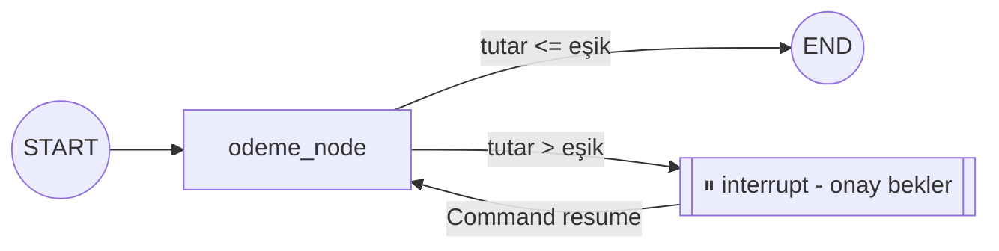

# Human-in-the-loop

<span class="badge badge-orta">🟡 ORTA SEVİYE</span>

Bazı adımlar (ör. ödeme yapma, e-posta gönderme, veri silme) otomatik değil, **insan onayıyla** ilerlemelidir. Bu tasarım desenine **human-in-the-loop** (döngüde insan) denir. LangGraph, checkpointer sayesinde grafı belirli bir noktada durdurup daha sonra kaldığı yerden devam ettirebilir.

## interrupt() — önerilen yöntem

LangGraph v1.0 itibarıyla, bir grafı durdurmanın **önerilen yolu** node'un içinden `interrupt()` çağırmaktır. Bu, hem koşulsuz hem de koşullu durma senaryolarını tek bir mekanizmayla kapsar:

```python
from langgraph.types import interrupt, Command

def onay_node(state: State):
    karar = interrupt({"soru": "Bu işlemi onaylıyor musunuz?", "tutar": state["tutar"]})
    return {"onaylandi": karar == "evet"}
```

Grafı devam ettirmek için `Command(resume=...)` kullanılır:

```python
config = {"configurable": {"thread_id": "islem-1"}}

# 1. Graf onay_node'da durur
app.invoke({"messages": [("user", "500 TL öde")]}, config)

# 2. Kullanıcıya/operatöre onay sorulur (UI, Slack mesajı, vb.)

# 3. Onay verildiyse, resume değeriyle devam et
app.invoke(Command(resume="evet"), config)
```

`interrupt()` çağrıldığında graf, `interrupt()`'a verilen değeri dışarı taşıyan bir istisna fırlatır ve **çalışmayı tamamen durdurur** — checkpointer bu noktayı kaydeder. `Command(resume=...)` ile devam ettirildiğinde, node **baştan itibaren yeniden çalışır** ve `interrupt()` çağrısı bu kez `resume` değerini döndürür.

!!! warning "Node yeniden çalışır — yan etkilere dikkat"
    `interrupt()` sonrası node baştan çalıştığı için, `interrupt()` çağrısından **önceki** kod da tekrar çalışır. Node içinde `interrupt()`'tan önce yan etkili işlemler (ödeme, e-posta) varsa, bunların idempotent olduğundan emin olun (bkz. [Production & Deployment](../ileri-seviye/production.md) sayfasındaki Idempotency bölümü).

## Koşullu durma — interrupt()'ı bir if içinde çağırmak

`interrupt()` sadece **belirli bir koşulda** çalışmalıysa (ör. işlem tutarı bir eşiği aşıyorsa), bunu basitçe bir `if` bloğunun içine koyarsınız:

```python
ONAY_ESIGI = 10_000

def odeme_node(state: State):
    if state["tutar"] > ONAY_ESIGI:
        karar = interrupt(f"{state['tutar']} TL onay eşiğini aşıyor — onaylıyor musunuz?")
        if karar != "evet":
            return {"durum": "reddedildi"}
    return {"durum": "odendi"}
```

!!! danger "NodeInterrupt kullanmayın — deprecated"
    Daha önce bu tür koşullu durmalar için `langgraph.errors.NodeInterrupt` kullanılıyordu. **`NodeInterrupt`, LangGraph v1.0 itibarıyla deprecated edildi ve v2.0'da kaldırılacak.** Yeni kodda yukarıdaki gibi `interrupt()`'ı bir koşulun içinde çağırmak yeterlidir — ayrı bir istisna sınıfına gerek yoktur.

### Görsel: koşullu durma akışı



## interrupt_before / interrupt_after — node bazlı breakpoint

`interrupt()` node'un **içinden** ince kontrol sağlarken, `interrupt_before`/`interrupt_after` grafı **derleme sırasında**, belirli bir node'dan önce/sonra kaba bir şekilde durdurmanızı sağlar — hızlı prototipleme ve debug için kullanışlıdır:

```python
app = graph.compile(
    checkpointer=checkpointer,
    interrupt_before=["tools"],  # tools node'undan önce dur
)

config = {"configurable": {"thread_id": "islem-1"}}

app.invoke({"messages": [("user", "500 TL öde")]}, config)  # tools'tan önce durur
app.invoke(None, config)  # kaldığı yerden devam (state değişmeden)
```

`None` ile `invoke` çağrısı, "state'i değiştirmeden kaldığın yerden devam et" anlamına gelir.

!!! tip "Ne zaman hangisi?"
    **`interrupt()`** — bugün yeni kod yazıyorsanız varsayılan seçim. Hem koşullu hem koşulsuz durma senaryolarını kapsar, hangi bilginin insana gideceğini node içinden tanımlarsınız. **`interrupt_before/after`** — grafın belirli bir node'unu hızlıca, kod değiştirmeden durdurup incelemek istediğiniz debug/prototipleme senaryoları için pratiktir.

## Durma noktasında state'i değiştirme

`interrupt_before` ile durdurulan bir grafta, devam etmeden önce state'i güncelleyebilirsiniz — ör. kullanıcı işlem tutarını değiştirdiyse:

```python
app.update_state(config, {"tutar": 400})
app.invoke(None, config)
```

---

Sıradaki adım: [Subgraph & Store](subgraph-store.md) ile modüler graf tasarımı.
