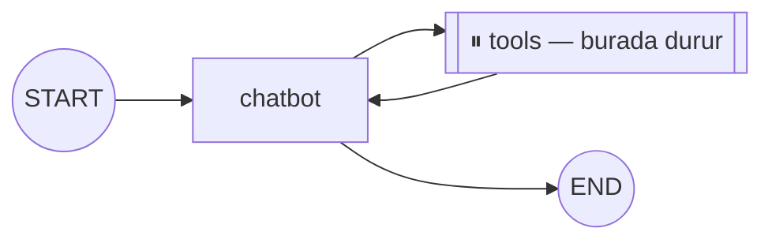

# Human-in-the-loop

<span class="badge badge-orta">🟡 ORTA SEVİYE</span>

Bazı adımlar (ör. ödeme yapma, e-posta gönderme, veri silme) otomatik değil, **insan onayıyla** ilerlemelidir. Bu tasarım desenine **human-in-the-loop** (döngüde insan) denir. LangGraph, checkpointer sayesinde grafı belirli bir node'dan önce/sonra durdurabilir.

## interrupt_before / interrupt_after

```python
app = graph.compile(
    checkpointer=checkpointer,
    interrupt_before=["tools"],  # tools node'undan önce dur
)

config = {"configurable": {"thread_id": "islem-1"}}

# 1. Graf "tools"tan önce durur
app.invoke({"messages": [("user", "500 TL öde")]}, config)

# 2. Kullanıcıya/operatöre onay sorulur (UI, Slack mesajı, vb.)

# 3. Onay verildiyse, kaldığı yerden devam et
app.invoke(None, config)
```

`None` ile `invoke` çağrısı, "state'i değiştirmeden kaldığın yerden devam et" anlamına gelir.

### Görsel: durma ve devam akışı



## Durma noktasında state'i değiştirme

Devam etmeden önce state'i güncelleyebilirsiniz — ör. kullanıcı işlem tutarını değiştirdiyse:

```python
app.update_state(config, {"tutar": 400})
app.invoke(None, config)
```

## interrupt() fonksiyonu ile ince kontrol (yeni API)

Daha güncel LangGraph sürümlerinde, node'un içinden doğrudan `interrupt()` (kesme/durma) çağırarak, hangi bilginin insana gösterileceğini ve dönen cevabın nasıl işleneceğini programatik olarak kontrol edebilirsiniz:

```python
from langgraph.types import interrupt, Command

def onay_node(state: State):
    karar = interrupt({"soru": "Bu işlemi onaylıyor musunuz?", "tutar": state["tutar"]})
    return {"onaylandi": karar == "evet"}

# Devam ettirmek için:
app.invoke(Command(resume="evet"), config)
```

!!! tip "Ne zaman hangisi?"
    `interrupt_before/after`, node bazında kaba bir durma noktasıdır — hızlı kurulur. `interrupt()`, node'un içinden hangi bilginin insana gideceğini ve cevabın nasıl işleneceğini tanımlamanıza izin verir — daha esnek ama biraz daha fazla kod gerektirir.

## NodeInterrupt — koşullu, node içinden fırlatılan kesme

`interrupt()` her zaman durur; bazen ise **sadece belirli bir koşulda** durmak istersiniz — ör. işlem tutarı bir eşiği aşıyorsa. `NodeInterrupt` istisnasını fırlatarak bunu node'un içinden koşullu şekilde tetikleyebilirsiniz:

```python
from langgraph.errors import NodeInterrupt

def odeme_node(state: State):
    if state["tutar"] > 10_000:
        raise NodeInterrupt(f"{state['tutar']} TL onay eşiğini aşıyor — manuel onay gerekli")
    return {"durum": "odendi"}
```

Graf bu node'da durur ve `NodeInterrupt`'ın mesajını taşıyan bir state ile bekler. Aynı `interrupt_before` akışındaki gibi `app.invoke(None, config)` ile devam ettirilir. Fark şu: durma kararı **grafın derlenme anında değil, node'un çalışma anında, veriye bakarak** verilir.

!!! example "Tipik kullanım"
    Küçük tutarlı işlemler otomatik geçsin, büyük tutarlılar insan onayına düşsün — aynı node içinde iş mantığına göre koşullu insan-döngüsü.

---

Sıradaki adım: [Subgraph & Store](subgraph-store.md) ile modüler graf tasarımı.
