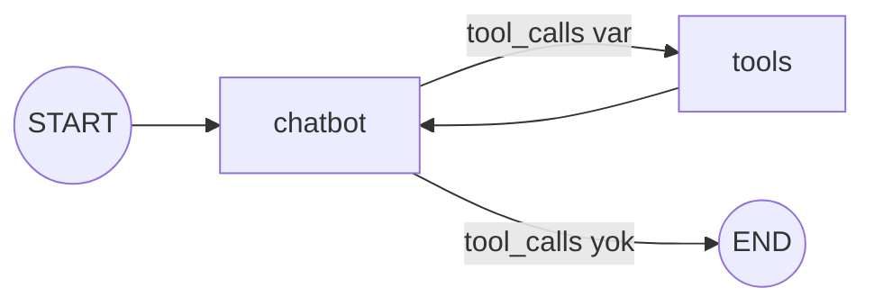

# ToolNode & Hazır Ajanlar

<span class="badge badge-orta">🟡 ORTA SEVİYE</span>

**Tool** (araç), modelin çağırabileceği, dış dünyayla etkileşim kuran bir fonksiyondur (ör. hava durumu sorgulama, veritabanı okuma). Araç çağırma döngüsünü (chatbot → araç → chatbot) elle kurmak yerine LangGraph'ın hazır bileşenlerini kullanabilirsiniz.

## ToolNode + tools_condition

```python
from langgraph.prebuilt import ToolNode, tools_condition
from langchain_core.tools import tool

@tool
def hava_durumu(sehir: str) -> str:
    """Verilen şehrin hava durumunu döner."""
    return f"{sehir}: 24°C, açık"

tools = [hava_durumu]
llm_with_tools = llm.bind_tools(tools)

def chatbot(state: State):
    return {"messages": [llm_with_tools.invoke(state["messages"])]}

graph.add_node("chatbot", chatbot)
graph.add_node("tools", ToolNode(tools))
graph.add_conditional_edges("chatbot", tools_condition)
graph.add_edge("tools", "chatbot")
```

`tools_condition`, son mesajda `tool_calls` varsa `"tools"` node'una, yoksa `END`'e yönlendiren hazır bir karar fonksiyonudur — bir önceki sayfada elle yazdığımız `yon_bul` fonksiyonunun hazır hâli.

### Görsel: araç çağırma döngüsü



`chatbot` ile `tools` arasındaki döngü, model gerektiği kadar araç çağırana kadar devam eder.

## create_react_agent — tek satırda ajan

**ReAct** (*Reason + Act* — "akıl yürüt ve eyle"), "düşün → araç çağır → sonucu değerlendir → gerekirse tekrar düşün" döngüsüne dayanan klasik ajan desenidir. Küçük/orta ölçekli görevler için grafı elle kurmanıza gerek yok — `create_react_agent` bu deseni hazır sağlar:

```python
from langgraph.prebuilt import create_react_agent

agent = create_react_agent(llm, tools=[hava_durumu])
agent.invoke({"messages": [("user", "İstanbul'da hava nasıl?")]})
```

!!! note "Ne zaman elle graf kurmalı?"
    `create_react_agent`, standart "düşün → araç çağır → cevapla" döngüsü için idealdir. Özel bir akış (birden fazla ajan, insan onayı, koşullu dallanma) gerekiyorsa, StateGraph'ı elle kurmak size çok daha fazla kontrol verir — bkz. [Multi-Agent Mimarileri](../ileri-seviye/multi-agent.md).

## Birden fazla araç

```python
tools = [hava_durumu, hesap_makinesi, veritabani_sorgula]
llm_with_tools = llm.bind_tools(tools)
```

Model, kullanıcının isteğine göre hangi aracı (ya da hiçbirini) çağıracağına kendisi karar verir; birden fazla aracı aynı anda da çağırabilir (`tool_calls` listesi birden fazla eleman içerebilir).

---

Sıradaki adım: LangGraph'ın ikinci yazım şekli — [Functional API](functional-api.md); atlamak istersen doğrudan [Checkpointer & Kalıcılık](checkpointer.md)'a geçebilirsin.
